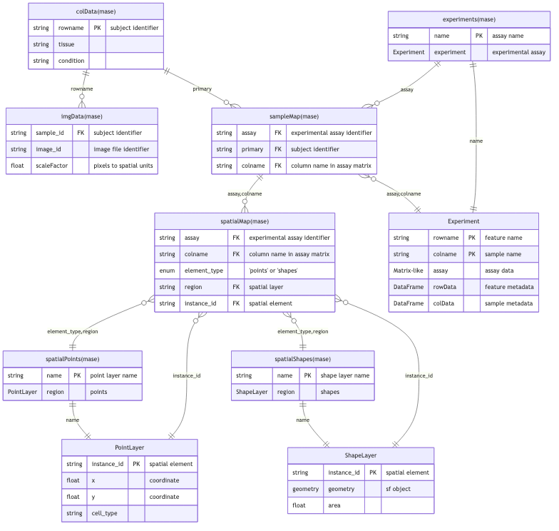

```{r setup, include = FALSE}
knitr::opts_chunk$set(
  collapse = TRUE,
  comment = "#>",
  cache = TRUE
)
```

# Installation

```{r install, eval = FALSE}
if (!require("BiocManager"))
    install.packages("BiocManager")
BiocManager::install("MultiAssaySpatialExperiment")
```

Load the package:

```{r load_packages, message = FALSE, warning = FALSE}
library(MultiAssaySpatialExperiment)
library(SummarizedExperiment)
library(S4Vectors)
```

# Citing MultiAssaySpatialExperiment

If you use `MultiAssaySpatialExperiment` in your research, please cite the
package. Citation information is available via:

```{r citation, eval = FALSE}
citation("MultiAssaySpatialExperiment")
```

# Why another spatial data structure?

If you have spent a few decades designing databases, you have seen the same
story many times: someone builds a system that works for one use case, and it
spreads. Later, a new use case appears that does not quite fit. People bolt on
workarounds, and the design gets messy. Eventually, someone steps back and asks:
what would we build if we started from the problem we actually have?

Spatial omics is at that stage. We already have excellent tools for
*single-assay* spatial data: `SpatialExperiment` and `SpatialFeatureExperiment`
handle one experiment at a time—one technology, one matrix, one set of spatial
coordinates. They work well when your question is "what genes are expressed in
this Visium section?" or "where are these MERFISH cells in tissue?" But
increasingly, people ask questions that cut across assays: "I have RNA, protein,
and chromatin from the same tissue—how do I link them and their spatial
coordinates in one place?" That is a different problem. It needs a *multi-assay*
structure that can carry spatial context and keep everything consistent when you
subset, or merge.

`MultiAssayExperiment` (MAE) solves the multi-assay part. It gives you a central
mapping table—the `sampleMap`—that links assay columns to specimens. One source
of truth, explicit foreign keys, and validity checks that keep the links
correct. When you subset by specimen, the maps update. No orphaned rows. No
hunting through metadata to figure out which assay column belongs to which
sample.

What MAE does not have is spatial geometry: coordinates for cells or spots, cell
boundaries, tissue images. That is where `MultiAssaySpatialExperiment` (MASE)
comes in. MASE extends MAE with spatial elements—points, shapes, images,
labels—and a second central mapping table, the `spatialMap`, that links assay
columns to those elements. Same philosophy as MAE: one place to look, one place
to update, referential integrity enforced. Subsetting updates `spatialMap` (and,
for most column- and assay-level operations, linked spatial layers) so you do
not have to clean up coordinates or drop orphaned geometries manually.

# When to use MASE

Use `MultiAssaySpatialExperiment` when:

- You have **multiple spatial assays** from the same or related tissue (e.g.,
  transcriptomics, proteomics, ATAC-seq).
- You need **one object** that holds the experiments, the specimen metadata, the
  spatial elements (coordinates, shapes, images), and the links between them.
- You want **subsetting and merging** that keep all links consistent—no manual
  cleanup, no orphaned geometry.
- You need to **convert** to or from `SpatialExperiment` or
  `SpatialFeatureExperiment` for downstream tools.

# Anatomy of a MultiAssaySpatialExperiment

## Overview

A `MultiAssaySpatialExperiment` object contains:

1. **Inherited from MultiAssayExperiment**:
   - `ExperimentList` — your assays (can be matrices, SummarizedExperiment,
     SingleCellExperiment, SpatialExperiment, or other supported classes)
   - `colData` — specimen/sample metadata (one row per biological unit)
   - `sampleMap` — links assay columns to specimens (primary identifiers)
   - `metadata` — experiment-level metadata

2. **Spatial elements (MASE-specific)**:
   - `points` — named lists of point coordinates (DataFrame with x, y,
     instance_id)
   - `shapes` — named lists of polygons or other geometries (DataFrame with sfc
     geometry column)
   - `images` — raster images (tissue photos, microscopy)
   - `labels` — segmentation masks (raster with instance IDs)

3. **Spatial mappings**:
   - `spatialMap` — links assay columns to spatial element rows (`assay`,
     `colname`, `element_type`, `region`, `instance_id`)
   - `imgData` — links specimens to images (`sample_id`, `image_id`, `scaleFactor`,
     and optional raster metadata)

The following diagram shows how these components relate:

```{r mase_erd, echo = FALSE, out.width = "100%", fig.cap = "Entity-Relationship Diagram showing MASE relational schema"}

```

The ERD shows the **actual class definition** with all slots:

**Inherited from MultiAssayExperiment** (tan boxes):
- `ExperimentList` — named list of assays (SE, SCE, matrices, etc.)
- `colData` — specimen metadata (rownames = primary identifiers)
- `sampleMap` — links assay columns to specimens via `(assay, primary, colname)`

**MASE-specific slots** (blue boxes):
- `points` — **PointsLayerList**: named list of DataFrames with coordinates
- `shapes` — **ShapesLayerList**: named list of DataFrames with geometries  
- `images` — **RasterLayerList**: named list of SpatialImage/matrix (tissue photos, H&E, etc.)
- `labels` — **RasterLayerList**: named list of SpatialImage/matrix (segmentation masks)
- `spatialMap` — DataFrame linking assay columns to spatial elements via `(assay, colname, element_type, region, instance_id)`
- `imgData` — DataFrame linking specimens to images via `(sample_id, image_id)`

**Key relationships:**
- `spatialMap$element_type` specifies which spatial slot: `"points"` or `"shapes"`
- `spatialMap$region` references a **layer name** within that slot (e.g., `"coords"`, `"cells"`)
- `spatialMap$instance_id` references a row within that layer's DataFrame
- Foreign key: `(element_type, region, instance_id)` → `slot(mase, element_type)[[region]]`
- Each layer is accessed as a named element: `points[[region]]`, `shapes[[region]]`, `images[[image_id]]`, `labels[[image_id]]`

## Components

### ExperimentList: assay data

The `ExperimentList` holds your experimental data. Each element is an assay
(e.g., RNA-seq, proteomics, ATAC-seq). Assays can be of different classes:

- `matrix` — base R matrix
- `SummarizedExperiment` — single-assay container with rowData, colData
- `SingleCellExperiment` — extends SummarizedExperiment with reducedDims, etc.
- `SpatialExperiment` — extends SingleCellExperiment with spatialCoords
- `SpatialFeatureExperiment` — extends SpatialExperiment with sf geometries

Requirements for classes in `ExperimentList`:

- Must support `[` subsetting
- Must have `colnames()` (used for linking to specimens via `sampleMap`)
- Row names are optional but useful for feature identification

### colData: specimen metadata

The `colData` is a `DataFrame` with one row per specimen (biological unit). Row
names are primary identifiers. Columns store metadata like patient ID, tissue
type, treatment, or any other specimen-level attribute.

**Terminology:** a **specimen** is a `colData` row; an **observation** is an
assay column (cell, spot, or bin). The `sampleMap` links observations to
specimens.

### sampleMap: assay-to-specimen mapping

The `sampleMap` is a three-column `DataFrame`:

| Column | Type | Description |
|--------|------|-------------|
| `assay` | factor | Name of the assay in `ExperimentList` |
| `primary` | character | Row name in `colData` (specimen ID) |
| `colname` | character | Column name in the assay |

This table says: "column X of assay Y belongs to specimen Z." Multiple assay
columns can map to the same specimen (technical or biological replicates).

### points: spatial coordinates

The `points` slot is a `PointsLayerList` (a named list of `DataFrame` objects).
Each element represents a set of point coordinates (e.g., cells, spots,
molecules). Required columns:

- `x`, `y` — numeric coordinates
- `instance_id` — character identifier for each point

Optional columns: `z` (for 3D), feature annotations, quality metrics.

### shapes: spatial geometries

The `shapes` slot is a `ShapesLayerList` (a named list of `DataFrame` objects).
Each element represents a set of polygons, lines, or other geometries. Required
columns:

- `geometry` — sfc (simple feature column from the `sf` package)
- `instance_id` — character identifier for each shape

Shapes are commonly used for cell boundaries, tissue regions, or annotation
areas.

### images: raster images

The `images` slot is a `RasterLayerList` (a named list). Each element is a
raster image (e.g., tissue H&E, fluorescence microscopy). Images can be:

- Base R arrays
- `SpatRaster` (from the `terra` package)
- File paths to images on disk

### labels: segmentation masks

The `labels` slot is a `RasterLayerList` (a named list). Each element is a
raster where pixel values are instance IDs (e.g., cell ID 1, 2, 3, ...). Labels
are used for segmentation masks that define which pixels belong to which object.

### spatialMap: assay-to-spatial mapping

The `spatialMap` is a five-column `DataFrame`:

| Column | Type | Description |
|--------|------|-------------|
| `assay` | factor | Name of the assay in `ExperimentList` |
| `colname` | character | Column name in the assay |
| `element_type` | character | Spatial slot: `"points"` or `"shapes"` |
| `region` | character | Layer name within that slot (e.g., `"coords"`, `"cells"`) |
| `instance_id` | character | Row identifier in the spatial layer |

This table says: "column X of assay Y is spatially located at row Z of element
W." The `spatialMap` is the key innovation: it allows multiple assays to share
the same spatial elements, and it keeps spatial links consistent during
subsetting.

**Validity constraints**:

- Every row in `spatialMap` must correspond to a valid row in `sampleMap` (same
  assay + colname).
- Every `instance_id` must exist in the corresponding points or shapes element.

### imgData: specimen-to-image mapping

The `imgData` is a `DataFrame` with one row per image–specimen pair (Visium
readers populate SPE-compatible columns). Typical columns include:

- `sample_id` — row name in `colData` (specimen identifier)
- `image_id` — name of the image in the `images` slot
- `scaleFactor` — numeric scale factor for pixel ↔ coordinate conversion
- `data`, `width`, `height`, `path` — raster payload or file reference (when loaded).

# Quick Start: Building a MASE object

Here is a minimal example to get you started:

```{r construct_minimal}
# Create a simple expression matrix
mat <- matrix(rnorm(20), nrow = 5, ncol = 4,
  dimnames = list(paste0("Gene", 1:5), paste0("Cell", 1:4)))

# Create point coordinates
pts <- DataFrame(
  x = c(1.2, 2.5, 3.1, 4.8),
  y = c(1.5, 2.3, 3.7, 4.2),
  instance_id = paste0("Cell", 1:4))

# Construct MASE
mase <- MultiAssaySpatialExperiment(
  experiments = ExperimentList(rna = mat),
  colData = DataFrame(row.names = paste0("Cell", 1:4)),
  sampleMap = DataFrame(
    assay = factor("rna", "rna"),
    primary = paste0("Cell", 1:4),
    colname = paste0("Cell", 1:4)
  ),
  points = PointsLayerList(coords = pts),
  spatialMap = DataFrame(
    assay = factor("rna", "rna"),
    colname = paste0("Cell", 1:4),
    element_type = "points",
    region = factor("coords", "coords"),
    instance_id = paste0("Cell", 1:4)
  )
)

mase
```

For more construction examples, including:

- Multi-assay MASE with shapes
- Building from matrices, SummarizedExperiment, SingleCellExperiment
- Adding images and labels
- Validation and common mistakes

See the **Working with MultiAssaySpatialExperiment** vignette.

# Accessors

## Inherited from MultiAssayExperiment

All MAE accessors work on MASE:

```{r accessors_mae}
# Get experiments
experiments(mase)

# Get specimen metadata
colData(mase)

# Get sampleMap
sampleMap(mase)

# Subset by assay
mase[, , "rna"]
```

## Spatial element accessors

MASE provides accessors for spatial elements:

```{r accessors_spatial}
# Get all spatial points
spatialPoints(mase)

# Get names of point elements
spatialPointNames(mase)

# Get a specific point element
spatialPoint(mase, "coords")

# Get spatial images (empty in this example)
spatialImages(mase)

# Get spatial labels (empty in this example)
spatialLabels(mase)
```

## Mapping accessors

```{r accessors_maps}
# Get spatialMap
spatialMap(mase)

# Get imgData (empty in this example)
imgData(mase)
```

# Subsetting

MASE supports all MAE subsetting operations, with propagation to spatial slots
where applicable:

- `subsetByColData(x, y)` — subset by specimen; updates `spatialMap` and
  `imgData` (point and shape rows are not trimmed unless removed via the map)
- `subsetByRow(x, y, ...)` — subset assay features (spatial layers unchanged)
- `subsetByColumn(x, y)` — subset assay columns; when `y` is a list, also
  trims linked points, shapes, images, and labels via `spatialMap`
- `subsetByAssay(x, y)` — subset by assay name; keeps spatial layers referenced
  in `spatialMap` for the retained assays
- `x[i, j, k, ...]` — combined subsetting (specimens, columns, assays, features)

Filter by observation metadata using the standard MAE list interface, for
example `subsetByColumn(mase, list(rna = colData(experiments(mase)[["rna"]])$tissue == "tumor"))`.

**Spatial subsetting** (geometry first, then assays via `spatialMap`):

- `subsetByBoundingBox(x, xmin, xmax, ymin, ymax, ...)` — rectangular ROI
- `subsetByPolygon(x, polygon, ...)` — polygon ROI

See the **Working with MultiAssaySpatialExperiment** vignette for detailed
subsetting examples.

# Spatial operations

MASE provides generics for spatial annotation and aggregation:

- `annotateWithRegions(x, points =, shapes =, ...)` — annotate measurement
  points with the shapes (cells, segments) they fall in
- `aggregateByRegion(x, by =, FUN =, ...)` — aggregate assay values by annotated
  region (e.g., sum transcript counts per cell)
- `spatialJoin(x, y, ...)` — join two spatial layer tables (DataFrame × DataFrame
  via `sf`; lower-level primitive for custom annotation workflows)

These functions use the `sf` package for spatial joins (default:
`st_intersects`). You can customize the join function (e.g., `st_nearest_feature`).

See the **Working with MultiAssaySpatialExperiment** vignette for detailed
examples.

# Coercion

MASE can convert to and from other Bioconductor spatial classes (when the
relevant packages are installed):

- `as(spe, "MultiAssaySpatialExperiment")` — wrap a
  `SpatialExperiment` as a single-assay MASE
- `as(mase, "SpatialExperiment")` — requires exactly one SPE-compatible assay
- `as(sfe, "MultiAssaySpatialExperiment")` — wrap a
  `SpatialFeatureExperiment` (requires **SpatialFeatureExperiment**)
- `as(mase, "SpatialFeatureExperiment")` — requires exactly one
  SPE/SFE-compatible assay

See the **MultiAssaySpatialExperiment use cases** vignette for coercion examples.

# Quick reference

The most common operations, grouped by task (see the man pages with `?` and the
other vignettes for details):

| Task | Functions |
|------|-----------|
| Construct | `MultiAssaySpatialExperiment()`, `prepMASE()`, `buildSpatialMap()` |
| Read a platform | `readXeniumMASE()`, `readVisiumMASE()`, `readVisiumHDMASE()`, `readCosMxMASE()`, `readMERSCOPEMASE()` |
| Spatial accessors | `spatialPoints()`, `spatialShapes()`, `spatialImages()`, `spatialLabels()`, `spatialMap()` |
| MAE accessors | `experiments()`, `colData()`, `sampleMap()`, `subsetByAssay()` |
| Subset | `mase[rows, cols, assays]`, by region (bounding box / polygon), by specimen |
| Annotate / aggregate | `annotateWithRegions()`, `aggregateByRegion()` (points ↔ shapes joins) |
| Labels ↔ shapes | rasterize (shapes → labels), vectorize (labels → shapes) |
| Coerce | `as(spe, "MultiAssaySpatialExperiment")`, `as(mase, "SpatialExperiment")` |

# Next steps

After reading this introduction, proceed to:

1. **Working with MultiAssaySpatialExperiment**: construction patterns, subsetting
   operations, spatial annotation and aggregation, and labels ↔ shapes conversion.
2. **MultiAssaySpatialExperiment use cases**: complete workflows for reading Xenium,
   Visium, Visium HD, CosMx, and MERSCOPE (MERFISH) data; converting from
   `SpatialExperiment` / `SpatialFeatureExperiment`; multi-assay integration
   (Xenium + Visium); coordinate transformation and alignment; and multi-sample
   analysis.

# Session info

```{r sessionInfo}
sessionInfo()
```
